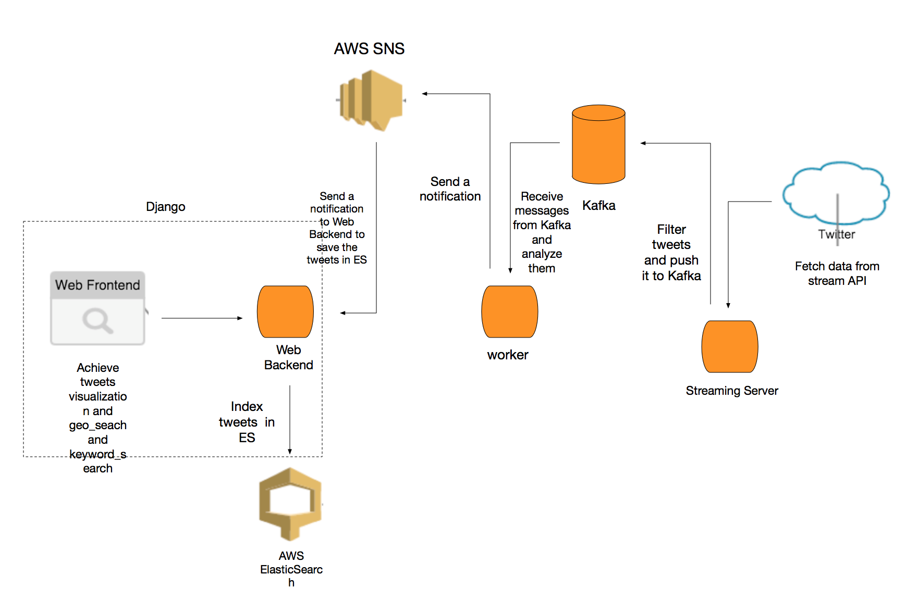

# TwittTrend
Show sentiments in tweets on Google map.

## Tech Stack
* Django: Python web framework
* Google Map APIs, Twitter Streaming APIs, Sentiment Analysis API
* Kafka
* Elasticsearch

#### AWS
* AWS Elastic Beanstalk
* AWS Elasticsearch
* AWS EC2 (for tweets streaming, sentiment analysis, and kafka)
* AWS Simple Notification Service (SNS)

## Dependencies
See [requirements.txt](requirements.txt)

## Deploy
* **AWS EC2**
	* `streaming/tweet_streamer.py`: the script to fetch tweets from twitter streaming API and send to Kafka.
	* `worker/worker.py`: Start a thread pool in which each worker consumes tweets from Kafka and perform sentiment analysis by calling API and send the tweet with sentiment to Amazon SNS.
	* `Kafka/`: it starts a zookeeper server and then a kafka server.
* **AWS Elastic beanstalk**
	* `django/`: contains the django web application.

## Architecture Diagram
